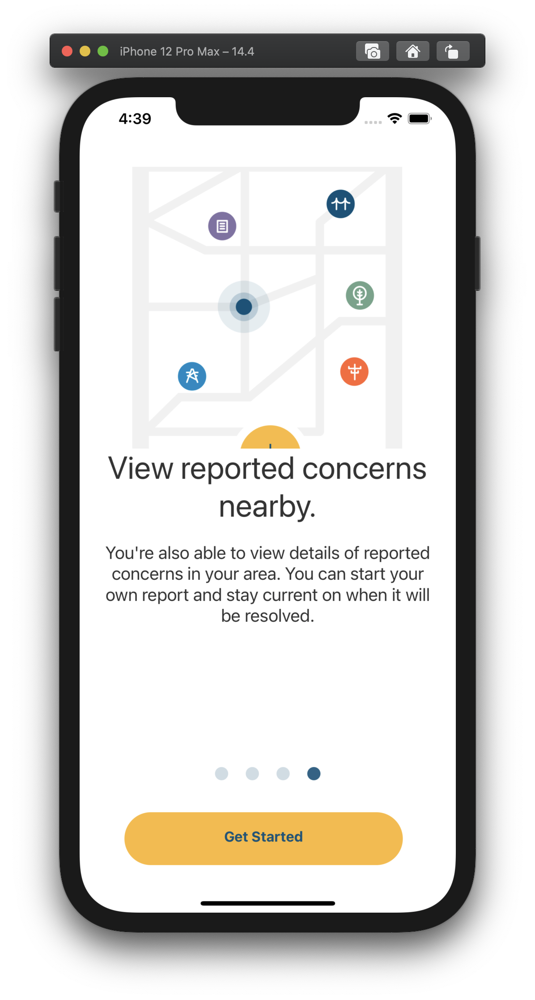
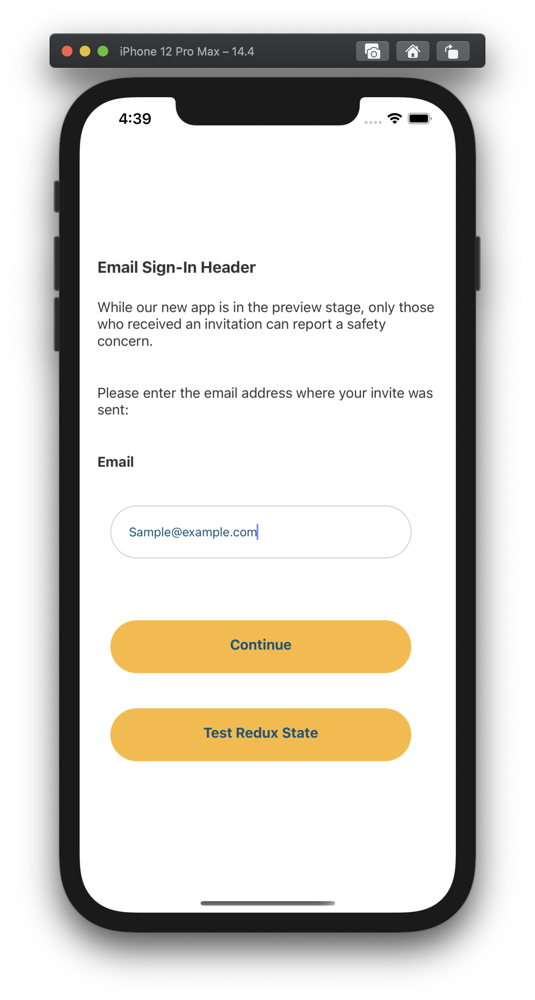
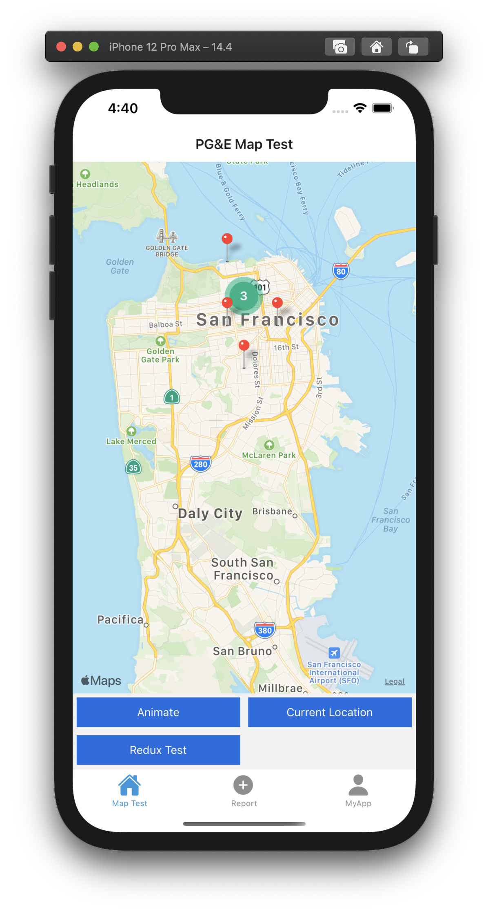
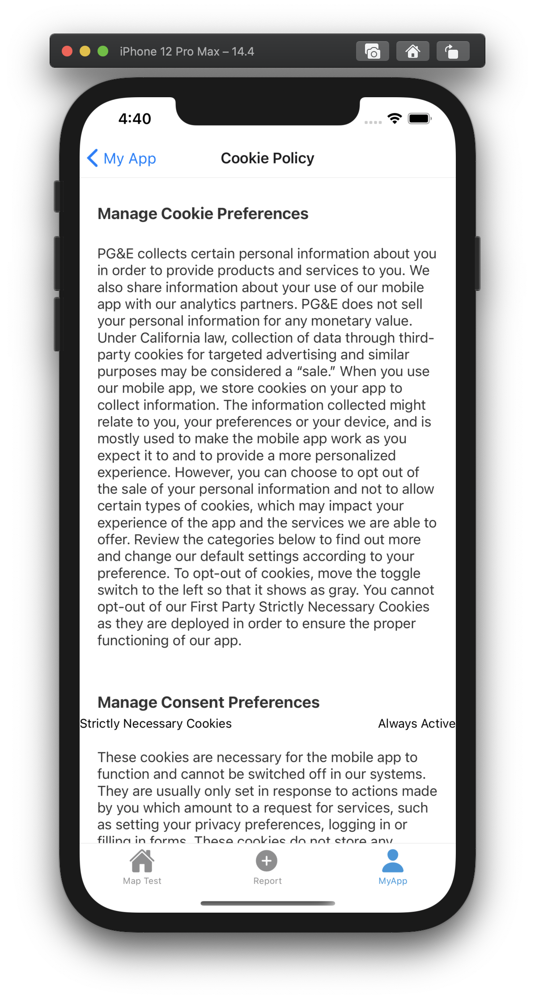

# PG&E Mobile App Safety Reporting Pilot 
A react native app for iOs and Android (portrait mode only)

## Quick Start Instruction:
1. Clone the project from repo:

2. Make sure the required items: node, yarn, ruby, and homebrew (only for for macOS/OS X users)
* ```npm install -g yarn ```

3. Install expo-cli
* ```npm install -g expo-cli ```

2. Install npm packages:
* ```npm install```

3. Start a local dev server for app dev/testing with:
* ```npm run start```

**[Click here for more documentation on the PG&E Mobile Safety Reporting App](./docs/DOCUMENTATION.md)**

## Screenshots:
<p float="left">




</p>

Note: These screens are only working prototypes. Styles and additional functionality to be updated soon.

