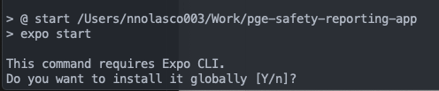
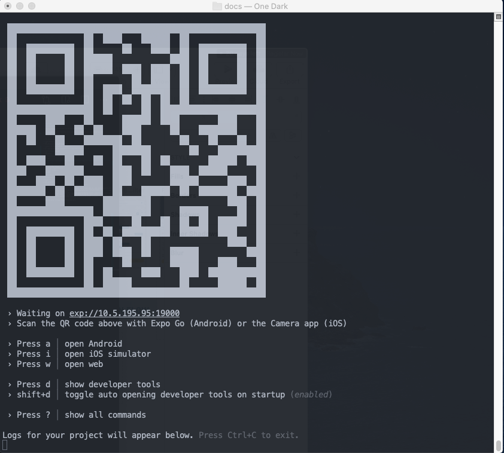
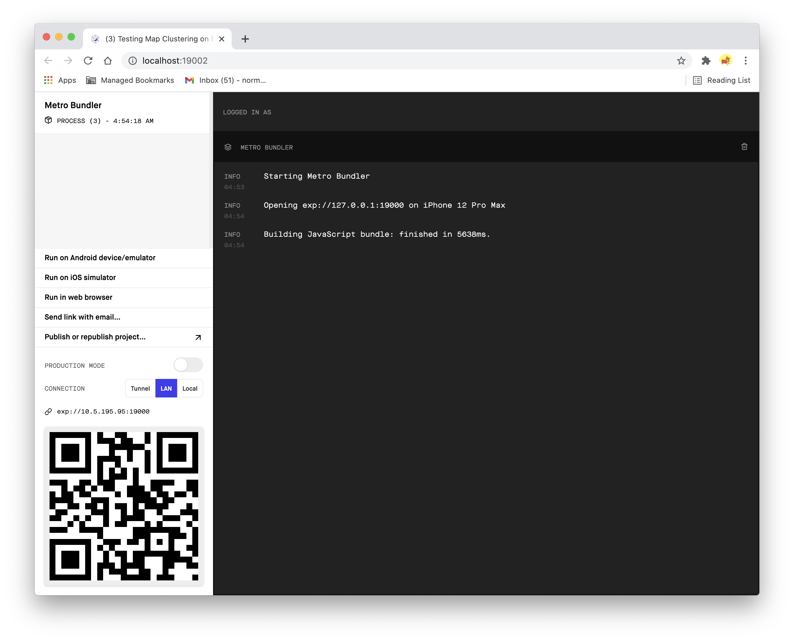
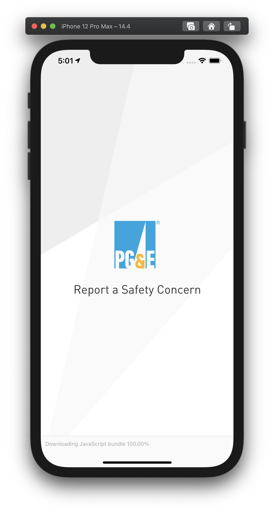

# Installation Guide

## Running the Application Locally

If you are setting up for the first time on your machine, perform below:
1. Installing HomeBrew:
```sh
$ /usr/bin/ruby -e "$(curl -fsSL https://raw.githubusercontent.com/Homebrew/install/master/install)"
$ brew install node
$ brew install watchman
```
2. If you have GIT skip below command
```sh
$ brew install git
```
3. Setup cocoapods
```sh
$ sudo gem install cocoapods && pod setup
```
4. Cloning the Project from the git repository:
```sh
$ git clone git@github.pwc.com:ExperienceCenter/pge-safety-reporting-app.git
```
5. Install project packages:
```sh
$ npm install
```
6. Start the project in the Expo execution environment:
```sh
$ npm start
```
If you do not have Expo installed, a message will be displayed asking you to install Expo CLI globally. Type "Y" or hit enter to accept the installation. The Expo CLI (Command Line Interface) is required to be installed globally for Expo projects to operate correctly.



7. This will start the project on your computer. Expo Developer Tools will open in a browser.

Your terminal should display this QR code. If you have a mobile device using Wifi on the same network, you can use the Expo Go mobile app to launch this project on your device via the QR code. Expo Go is available from the Apple App Store or the Google Play Store.



Expo's Metro Bundler should also open in a browser automatically. Click on "Run on iOS simulator" on the left side to pop-up a mobile emulator on your Mac.



The project mobile app should start in the emulator.



# Build and Test

```sh
$ npm config set strict-ssl false
$ npm cache clean --force
$ npm install --unsafe-perm=true
$ npm install -g yarn
$ npm install -g expo-cli
$ npm install
$ npm start
```
To Build Android:
```sh
$ expo build:android
```
To Build iOs:
```sh
$ expo build:ios
```


***Important Notes***:
- Before making changes to the app, make sure you've pulled latest changes from dev, from create a branch to later merge those changes into dev. You can find more details in the [Updating the App Guide](updating-guide.md)
- If you experience issues when running the app, the first step is to run ```npx react-native doctor```. It will show all common errors and try to fix them automatically
- Verify expo installation: Verify that the installation was successful by running ```expo whoami```. If you're not logged in yet, so you will see "Not logged in". You can create an account by running ```expo register``` if you like, or if you have one already run ```expo login```, but you also don't need an account to get started.
- When making an update to tailwind.config.js you need to re-create styles.json by running ```npx create-tailwind-rn```.

[Click here for more details](https://github.com/vadimdemedes/tailwind-rn)

